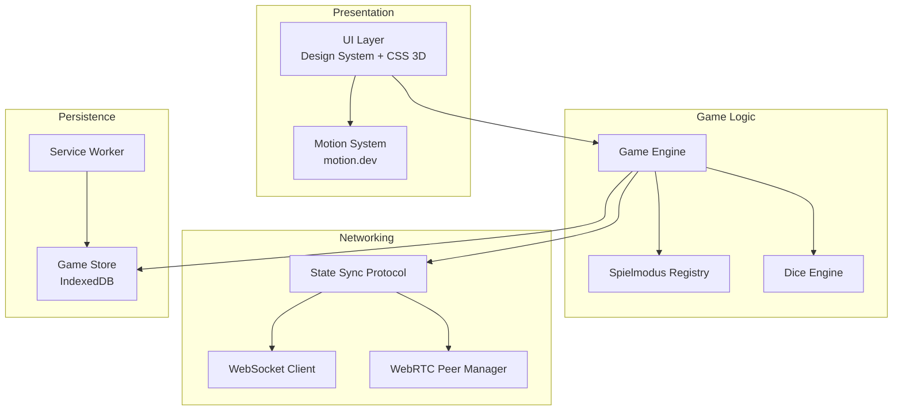
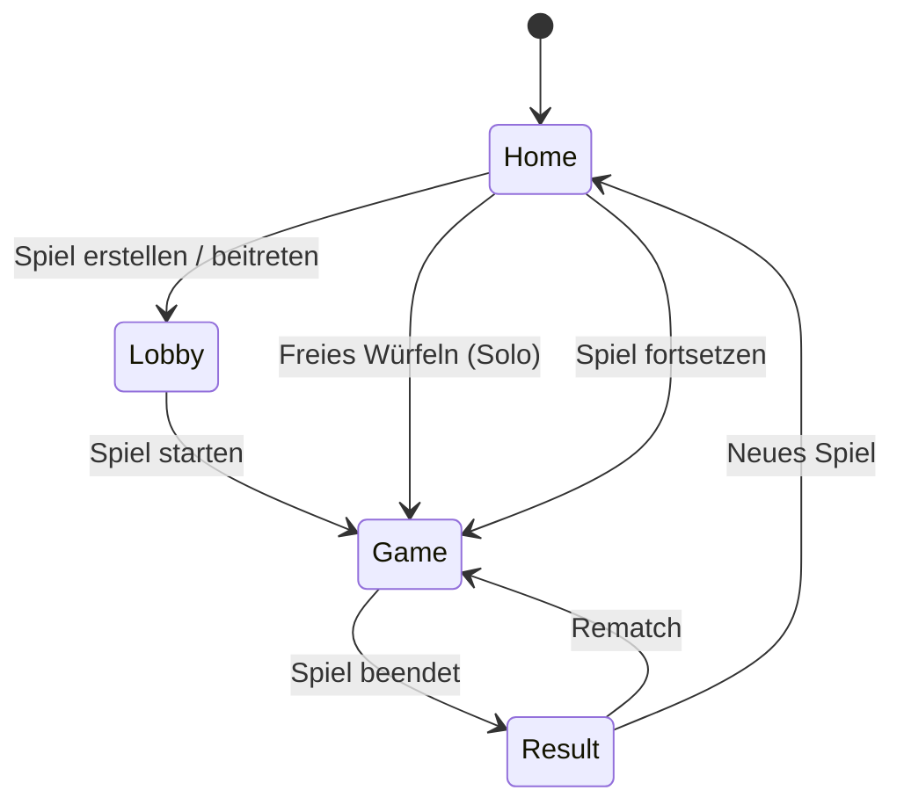
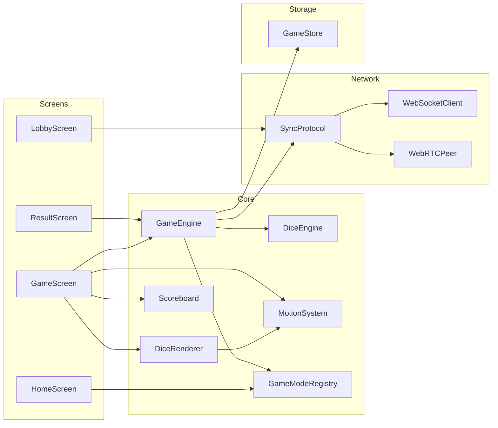

# Design-Dokument — Dice Game PWA

## Übersicht

Die Dice Game PWA ist eine erweiterbare Würfelspiel-Plattform, die als Progressive Web App realisiert wird. Die App kombiniert das bestehende adaptive CSS-Design-System mit motion.dev für Animationen und CSS-basiertem 3D-Rendering für eine softe, hochwertige Würfeloptik.

Die Architektur folgt einem modularen Ansatz mit klar getrennten Schichten:

- **Presentation Layer**: Vanilla HTML/CSS/JS mit dem bestehenden Design System, motion.dev für Animationen
- **Game Logic Layer**: Erweiterbares Spielmodus-System mit Registry-Pattern
- **Networking Layer**: WebSocket für Online-Multiplayer, WebRTC für Offline-Peer-to-Peer
- **Persistence Layer**: LocalStorage/IndexedDB für Spielstand-Persistenz und Service Worker für Offline-Caching

Technologie-Entscheidungen:
- **Kein Framework** — Vanilla JS mit ES-Modulen, passend zum bestehenden CSS-Design-System
- **CSS 3D statt WebGL** — Softe 3D-Optik via CSS `perspective`, `transform`, Schatten und Verläufe, animiert mit motion.dev Spring-Physik
- **motion.dev** — Spring-basierte Animationen für Würfelwürfe und UI-Übergänge
- **Web Crypto API** — Kryptografisch sichere Zufallszahlen für faire Würfelergebnisse



## Architektur

### Projektstruktur

```
dice-game-pwa/
├── index.html                    # App-Einstiegspunkt (PWA Shell)
├── manifest.json                 # Web App Manifest
├── sw.js                         # Service Worker
├── css/
│   ├── dice.css                  # 3D-Würfel-Styling
│   ├── game.css                  # Spielfeld-Layout
│   └── screens.css               # Screen-spezifische Styles
├── js/
│   ├── app.js                    # App-Bootstrap, Router
│   ├── i18n.js                   # Lokalisierungssystem
│   ├── motion/
│   │   └── motion-system.js      # Motion.dev Wrapper mit Presets
│   ├── dice/
│   │   ├── dice-engine.js        # Würfelwurf-Logik (Crypto RNG)
│   │   └── dice-renderer.js      # CSS 3D Würfel-Rendering
│   ├── game/
│   │   ├── game-engine.js        # Spielablauf-Steuerung
│   │   ├── game-mode-registry.js # Spielmodus-Registry
│   │   ├── scoreboard.js         # Scoreboard-Logik
│   │   └── modes/
│   │       ├── free-roll.js      # Freies Würfeln
│   │       └── kniffel.js        # Kniffel-Regelwerk
│   ├── multiplayer/
│   │   ├── sync-protocol.js      # Gemeinsames Sync-Protokoll
│   │   ├── websocket-client.js   # Online-Multiplayer
│   │   └── webrtc-peer.js        # Offline P2P-Multiplayer
│   ├── store/
│   │   └── game-store.js         # IndexedDB Spielstand-Persistenz
│   └── screens/
│       ├── home-screen.js        # Startbildschirm
│       ├── lobby-screen.js       # Lobby (Online + Offline)
│       ├── game-screen.js        # Spielfeld
│       └── result-screen.js      # Ergebnisübersicht
└── locales/
    └── de.json                   # Deutsche Lokalisierung
```

### Screen-Flow



### Rendering-Ansatz: CSS 3D Würfel

Die Würfel werden als CSS-3D-Objekte mit `transform-style: preserve-3d` realisiert. Jede Würfelseite ist ein absolut positioniertes `<div>` mit CSS-Transforms für die korrekte 3D-Position. Die softe Optik entsteht durch:

- `border-radius` für abgerundete Kanten
- `box-shadow` mit mehreren Layern für weiche Schatten
- CSS-Verläufe (`linear-gradient`) für Lichtreflexionen
- `perspective` auf dem Container für räumliche Tiefe

motion.dev animiert die `rotateX`/`rotateY`/`rotateZ`-Werte mit Spring-Physik, sodass die Würfel physikalisch plausibel rollen und einrasten.


## Komponenten und Schnittstellen

### 1. Motion System (`motion-system.js`)

Zentraler Wrapper um motion.dev mit vordefinierten Presets.

```typescript
// Schnittstelle (konzeptionell, Implementierung in Vanilla JS)
interface MotionSystem {
  // Vordefinierte Presets
  presets: {
    fadeIn: SpringConfig;
    fadeOut: SpringConfig;
    scaleIn: SpringConfig;
    slideUp: SpringConfig;
    slideDown: SpringConfig;
    diceRoll: SpringConfig;    // Stärkere Spring-Physik für Würfel
    diceBounce: SpringConfig;  // Nachfeder-Effekt
  };

  // Animiert ein Element mit einem Preset oder Custom-Config
  animate(element: HTMLElement, keyframes: object, config?: SpringConfig): Animation;

  // Prüft prefers-reduced-motion und gibt sofortigen Zustandswechsel zurück
  shouldReduceMotion(): boolean;

  // Screen-Übergang
  transition(outElement: HTMLElement, inElement: HTMLElement, type: 'slide' | 'fade'): Promise<void>;
}
```

Bei `prefers-reduced-motion: reduce` werden alle Animationen auf `duration: 0` gesetzt — kein Spring, kein Übergang, sofortiger Zustandswechsel.

### 2. Dice Engine (`dice-engine.js`)

Verantwortlich für Zufallsgenerierung und Würfelzustand.

```typescript
interface DiceEngine {
  // Generiert kryptografisch sichere Zufallswerte (1-6)
  roll(count: number, heldIndices: Set<number>): DiceResult;

  // Aktueller Würfelzustand
  getState(): DiceState;

  // Würfel halten/freigeben
  toggleHold(index: number): void;

  // Alle Würfel zurücksetzen
  reset(count: number): void;
}

interface DiceResult {
  values: number[];       // Array der Würfelwerte [1-6]
  rolledIndices: number[]; // Welche Würfel tatsächlich gewürfelt wurden
}

interface DiceState {
  values: number[];       // Aktuelle Werte aller Würfel
  held: Set<number>;      // Indizes der gehaltenen Würfel
  count: number;          // Anzahl der Würfel
}
```

### 3. Dice Renderer (`dice-renderer.js`)

CSS-3D-Rendering der Würfel mit motion.dev-Animationen.

```typescript
interface DiceRenderer {
  // Erstellt die DOM-Elemente für n Würfel
  create(container: HTMLElement, count: number): void;

  // Aktualisiert die Anzeige nach einem Wurf (mit Animation)
  update(result: DiceResult, animate: boolean): Promise<void>;

  // Setzt den visuellen Haltezustand eines Würfels
  setHeld(index: number, held: boolean): void;

  // Entfernt alle Würfel-DOM-Elemente
  destroy(): void;
}
```

### 4. Game Mode Registry (`game-mode-registry.js`)

Registry-Pattern für erweiterbare Spielmodi.

```typescript
interface GameModeConfig {
  id: string;                    // Eindeutige ID (z.B. 'kniffel')
  name: string;                  // Anzeigename (i18n-Key)
  diceCount: number;             // Anzahl der Würfel (1-6)
  maxPlayers: number;            // Maximale Spieleranzahl
  maxRounds: number | null;      // Rundenlimit (null = unbegrenzt)
  rollsPerTurn: number | null;   // Würfe pro Zug (null = unbegrenzt)
  scoring: ScoringStrategy;      // Bewertungslogik
  categories?: ScoreCategory[];  // Optionale Wertungskategorien (z.B. Kniffel)
}

interface ScoringStrategy {
  // Berechnet mögliche Punktzahlen für einen Wurf
  calculateOptions(dice: number[], state: GameState): ScoreOption[];

  // Wendet eine gewählte Wertung an
  applyScore(option: ScoreOption, state: GameState): GameState;

  // Prüft ob das Spiel beendet ist
  isGameOver(state: GameState): boolean;

  // Berechnet Endpunktzahlen
  getFinalScores(state: GameState): PlayerScore[];
}

interface GameModeRegistry {
  register(config: GameModeConfig): void;
  get(id: string): GameModeConfig | undefined;
  getAll(): GameModeConfig[];
}
```

### 5. Game Engine (`game-engine.js`)

Steuert den Spielablauf und koordiniert alle Subsysteme.

```typescript
interface GameEngine {
  // Neues Spiel starten
  startGame(modeId: string, players: Player[]): GameState;

  // Würfeln
  roll(): DiceResult;

  // Wertung wählen (für Modi mit Kategorien)
  selectScore(option: ScoreOption): void;

  // Nächster Spieler
  nextTurn(): void;

  // Aktueller Zustand
  getState(): GameState;

  // Event-System für UI-Updates
  on(event: GameEvent, handler: Function): void;
}

type GameEvent = 'stateChange' | 'roll' | 'turnEnd' | 'gameOver' | 'playerDisconnected' | 'playerReconnected';
```

### 6. Sync Protocol (`sync-protocol.js`)

Abstrahiert die Synchronisation über WebSocket und WebRTC.

```typescript
interface SyncProtocol {
  // Verbindung herstellen
  connect(config: ConnectionConfig): Promise<void>;

  // Spielaktion senden
  sendAction(action: GameAction): void;

  // Aktionen empfangen
  onAction(handler: (action: GameAction) => void): void;

  // Verbindungsstatus
  onConnectionChange(handler: (status: ConnectionStatus) => void): void;

  // Trennen
  disconnect(): void;
}

interface GameAction {
  type: 'roll' | 'hold' | 'score' | 'nextTurn' | 'join' | 'leave' | 'sync';
  playerId: string;
  payload: any;
  timestamp: number;
}

type ConnectionConfig =
  | { type: 'websocket'; url: string; gameId: string }
  | { type: 'webrtc'; isHost: boolean };

type ConnectionStatus = 'connecting' | 'connected' | 'disconnected' | 'reconnecting';
```

### 7. Game Store (`game-store.js`)

IndexedDB-basierte Persistenz für Spielstände.

```typescript
interface GameStore {
  // Spielstand speichern
  save(state: GameState): Promise<void>;

  // Spielstand laden
  load(gameId: string): Promise<GameState | null>;

  // Aktive (nicht beendete) Spiele auflisten
  listActive(): Promise<GameSummary[]>;

  // Spielstand löschen
  delete(gameId: string): Promise<void>;
}
```

### 8. i18n System (`i18n.js`)

Zentrales Lokalisierungssystem für alle Texte.

```typescript
interface I18n {
  // Aktuelle Sprache setzen
  setLocale(locale: string): Promise<void>;

  // Text abrufen (mit optionalen Platzhaltern)
  t(key: string, params?: Record<string, string | number>): string;

  // Aktuelle Sprache
  locale: string;
}
```

### Komponentendiagramm




## Datenmodelle

### GameState

Zentrales Datenmodell für den gesamten Spielzustand. Wird für Persistenz (IndexedDB), Synchronisation (WebSocket/WebRTC) und UI-Rendering verwendet.

```typescript
interface GameState {
  gameId: string;                // Eindeutige Spiel-ID (UUID)
  modeId: string;                // Spielmodus-ID (z.B. 'kniffel', 'free-roll')
  status: 'lobby' | 'playing' | 'finished';
  players: Player[];
  currentPlayerIndex: number;    // Index des aktiven Spielers
  currentRound: number;          // Aktuelle Runde (1-basiert)
  maxRounds: number | null;
  dice: DiceState;
  rollsThisTurn: number;         // Anzahl Würfe im aktuellen Zug
  scores: Record<string, PlayerScoreSheet>; // playerId → Scores
  createdAt: number;             // Timestamp
  updatedAt: number;             // Timestamp
}

interface Player {
  id: string;                    // Eindeutige Spieler-ID
  name: string;                  // Anzeigename
  connectionStatus: 'connected' | 'disconnected';
  isHost: boolean;               // Ersteller des Spiels
}

interface DiceState {
  values: number[];              // Aktuelle Würfelwerte [1-6]
  held: boolean[];               // Haltezustand pro Würfel
  count: number;                 // Anzahl Würfel
}

interface PlayerScoreSheet {
  playerId: string;
  totalScore: number;
  categories: Record<string, number | null>; // Kategorie → Punkte (null = noch nicht belegt)
}
```

### Kniffel-spezifische Datenstrukturen

```typescript
interface KniffelScoreSheet extends PlayerScoreSheet {
  categories: {
    // Oberer Block
    ones: number | null;
    twos: number | null;
    threes: number | null;
    fours: number | null;
    fives: number | null;
    sixes: number | null;
    upperBonus: number | null;    // 35 Punkte bei >= 63 im oberen Block

    // Unterer Block
    threeOfAKind: number | null;
    fourOfAKind: number | null;
    fullHouse: number | null;     // 25 Punkte
    smallStraight: number | null; // 30 Punkte
    largeStraight: number | null; // 40 Punkte
    kniffel: number | null;       // 50 Punkte
    chance: number | null;
  };
}
```

### Serialisierungsformat

GameState wird als JSON in IndexedDB gespeichert und über das Sync-Protokoll übertragen. Das Format ist identisch — keine separate Transformation nötig.

```typescript
// Persistenz
const serialized: string = JSON.stringify(gameState);
const deserialized: GameState = JSON.parse(serialized);

// Sync-Nachricht
interface SyncMessage {
  type: 'action' | 'fullSync' | 'ack';
  gameId: string;
  action?: GameAction;
  state?: GameState;       // Nur bei fullSync (Reconnect)
  timestamp: number;
}
```

### IndexedDB Schema

```
Database: dice-game-pwa
├── ObjectStore: games
│   ├── keyPath: gameId
│   └── Indexes:
│       ├── status (für listActive-Abfrage)
│       └── updatedAt (für Sortierung)
```


## Correctness Properties

*Eine Property ist eine Eigenschaft oder ein Verhalten, das über alle gültigen Ausführungen eines Systems hinweg gelten sollte — im Grunde eine formale Aussage darüber, was das System tun soll. Properties bilden die Brücke zwischen menschenlesbaren Spezifikationen und maschinell verifizierbaren Korrektheitsgarantien.*

### Property 1: Würfelwurf-Gültigkeit und Halte-Invarianz

*Für beliebige* Würfelanzahlen (1–6) und beliebige Kombinationen gehaltener Würfel gilt: Nach einem Wurf liegen alle Werte im Bereich [1, 6], gehaltene Würfel behalten ihren vorherigen Wert, und nur nicht-gehaltene Würfel erhalten neue Werte.

**Validates: Requirements 4.1, 4.2, 4.4**

### Property 2: Würfel-Rendering erzeugt korrekte Anzahl

*Für jede* gültige Würfelanzahl n (1 ≤ n ≤ 6) gilt: Der Dice Renderer erzeugt exakt n Würfel-DOM-Elemente im Container.

**Validates: Requirements 3.4**

### Property 3: Spielmodus-Registry Round-Trip

*Für jede* gültige GameModeConfig mit allen Pflichtfeldern (id, name, diceCount, maxPlayers, maxRounds, scoring) gilt: Nach Registrierung über `register()` liefert `get(id)` die identische Konfiguration zurück, und `getAll()` enthält diese Konfiguration.

**Validates: Requirements 5.1, 5.2, 5.3**

### Property 4: Endpunktzahlen-Sortierung

*Für jeden* abgeschlossenen Spielzustand mit beliebigen Spielern und Punktzahlen gilt: `getFinalScores()` liefert die Spieler in absteigender Reihenfolge ihrer Gesamtpunktzahl, und die Platzierungen sind korrekt vergeben (gleiche Punktzahl = gleiche Platzierung).

**Validates: Requirements 6.3**

### Property 5: Spielstand-Serialisierung Round-Trip

*Für jeden* gültigen GameState gilt: Speichern via `save()` und anschließendes Laden via `load(gameId)` liefert einen semantisch identischen Spielzustand zurück.

**Validates: Requirements 6.4**

### Property 6: Aktive-Spiele-Filter

*Für jede* Menge gespeicherter Spiele mit beliebigen Status-Werten gilt: `listActive()` liefert ausschließlich Spiele mit `status !== 'finished'`, und kein aktives Spiel fehlt im Ergebnis.

**Validates: Requirements 6.5**

### Property 7: Spieler-Disconnect setzt Status

*Für jeden* Spielzustand und jeden verbundenen Spieler gilt: Wenn die Verbindung des Spielers abbricht, wird sein `connectionStatus` auf `'disconnected'` gesetzt, und der Spielstatus bleibt `'playing'` für die verbleibenden Spieler.

**Validates: Requirements 7.4, 8.5**

### Property 8: Spieler-Reconnect stellt Zustand wieder her

*Für jeden* Spielzustand mit einem getrennten Spieler gilt: Nach erneuter Verbindung wird der `connectionStatus` des Spielers auf `'connected'` gesetzt, und der Spieler erhält den aktuellen, vollständigen Spielzustand.

**Validates: Requirements 7.5**

### Property 9: Reduced Motion deaktiviert Animationen

*Für jedes* Animationspreset im Motion System gilt: Wenn `shouldReduceMotion()` true zurückgibt, hat die resultierende Animationskonfiguration eine effektive Dauer von 0 (sofortiger Zustandswechsel).

**Validates: Requirements 2.4**

### Property 10: i18n-Schlüssel-Auflösung mit Platzhaltern

*Für jeden* definierten i18n-Schlüssel und beliebige Platzhalter-Werte gilt: `t(key, params)` liefert einen nicht-leeren String, in dem alle Platzhalter durch die übergebenen Werte ersetzt sind und keine unresolvierten Platzhalter-Marker verbleiben.

**Validates: Requirements 9.6**

### Property 11: ARIA-Live-Region enthält Würfelergebnis

*Für jedes* Würfelergebnis (Array von Werten 1–6) gilt: Nach dem Wurf enthält die ARIA-Live-Region einen Text, der alle Würfelwerte des Ergebnisses beinhaltet.

**Validates: Requirements 10.3**

### Property 12: Kniffel-Bewertung berechnet korrekte Punktzahlen

*Für jede* gültige Kombination von 5 Würfeln (Werte 1–6) und jede Kniffel-Kategorie gilt: `calculateOptions()` liefert die korrekte Punktzahl gemäß dem offiziellen Kniffel-Regelwerk (z.B. Full House = 25, Große Straße = 40, Kniffel = 50, Oberer Block = Summe der jeweiligen Augenzahl).

**Validates: Requirements 5.5**


## Fehlerbehandlung

### Netzwerk-Fehler

| Szenario | Verhalten |
|---|---|
| WebSocket-Verbindung verloren | Automatischer Reconnect-Versuch (exponential backoff, max 5 Versuche). Spieler wird als `disconnected` markiert. UI zeigt Verbindungsstatus. |
| WebRTC-Peer-Verbindung verloren | Peer wird als `disconnected` markiert. Host versucht erneute Signalisierung. UI zeigt Verbindungsstatus. |
| Reconnect erfolgreich | Full-State-Sync vom Host/Server. Spieler wird als `connected` markiert. Spiel läuft nahtlos weiter. |
| Reconnect fehlgeschlagen (alle Versuche) | UI zeigt Fehlermeldung mit Option "Erneut versuchen" oder "Zum Startbildschirm". Spielstand bleibt lokal gespeichert. |

### Persistenz-Fehler

| Szenario | Verhalten |
|---|---|
| IndexedDB nicht verfügbar | Fallback auf `localStorage` für grundlegende Spielstand-Persistenz. Warnung im UI. |
| Speichern fehlgeschlagen | Retry nach 1 Sekunde. Bei erneutem Fehler: Warnung im UI, Spiel läuft im Speicher weiter. |
| Korrupter Spielstand beim Laden | Spielstand wird verworfen. UI zeigt Hinweis "Spielstand konnte nicht geladen werden". |

### Spiellogik-Fehler

| Szenario | Verhalten |
|---|---|
| Ungültiger Spielmodus-ID | Fallback auf "Freies Würfeln". Warnung in der Konsole. |
| Ungültige Spieleraktion (z.B. Würfeln wenn nicht am Zug) | Aktion wird ignoriert. Kein Fehler im UI. |
| Crypto API nicht verfügbar | Fallback auf `Math.random()`. Warnung in der Konsole. |

### Service Worker-Fehler

| Szenario | Verhalten |
|---|---|
| Service Worker Registration fehlgeschlagen | App funktioniert weiterhin, aber ohne Offline-Fähigkeit. Kein Fehler im UI. |
| Cache-Update fehlgeschlagen | Alte Cache-Version wird weiter verwendet. Nächster Versuch beim nächsten App-Start. |

## Teststrategie

### Dualer Testansatz

Die App verwendet sowohl Unit-Tests als auch Property-basierte Tests für umfassende Abdeckung:

- **Unit-Tests**: Spezifische Beispiele, Edge Cases, Fehlerbedingungen
- **Property-Tests**: Universelle Eigenschaften über alle gültigen Eingaben

Beide Ansätze sind komplementär — Unit-Tests fangen konkrete Bugs, Property-Tests verifizieren allgemeine Korrektheit.

### Property-Based Testing Konfiguration

- **Bibliothek**: [fast-check](https://github.com/dubzzz/fast-check) — die etablierte PBT-Bibliothek für JavaScript/TypeScript
- **Test-Runner**: Vitest
- **Mindest-Iterationen**: 100 pro Property-Test
- **Tagging-Format**: Jeder Property-Test wird mit einem Kommentar annotiert:
  ```
  // Feature: dice-game-pwa, Property {number}: {property_text}
  ```
- **Jede Correctness Property wird durch genau EINEN Property-basierten Test implementiert**

### Unit-Tests

Unit-Tests fokussieren sich auf:

- **Spezifische Beispiele**: Bekannte Kniffel-Kombinationen (z.B. [1,1,1,1,1] = Kniffel = 50 Punkte)
- **Edge Cases**: 0 Spieler, maximale Spieleranzahl, leere Würfelliste, alle Würfel gehalten
- **Fehlerbedingungen**: Ungültige Spielmodus-IDs, korrupte Spielstände, fehlende i18n-Keys
- **Integrationspunkte**: Zusammenspiel von GameEngine und ScoringStrategy

Unit-Tests sollten sparsam eingesetzt werden — Property-Tests decken die Breite ab.

### Testabdeckung nach Komponente

| Komponente | Unit-Tests | Property-Tests |
|---|---|---|
| DiceEngine | Edge Cases (alle gehalten, keine gehalten) | Property 1: Würfelwurf-Gültigkeit |
| DiceRenderer | — | Property 2: Korrekte Anzahl |
| GameModeRegistry | Beispiel: free-roll, kniffel existieren | Property 3: Registry Round-Trip |
| ScoringStrategy (Kniffel) | Bekannte Kombinationen | Property 12: Kniffel-Bewertung |
| GameEngine | Spielablauf-Szenarien | Property 4: Endpunktzahlen-Sortierung |
| GameStore | Fehlerbehandlung | Property 5: Serialisierung Round-Trip, Property 6: Aktive-Spiele-Filter |
| SyncProtocol | — | Property 7: Disconnect, Property 8: Reconnect |
| MotionSystem | — | Property 9: Reduced Motion |
| i18n | Fehlende Keys | Property 10: Schlüssel-Auflösung |
| Accessibility | ARIA-Attribute vorhanden | Property 11: ARIA-Live-Region |

