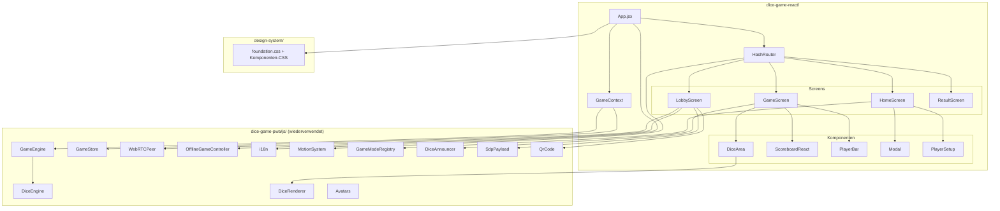
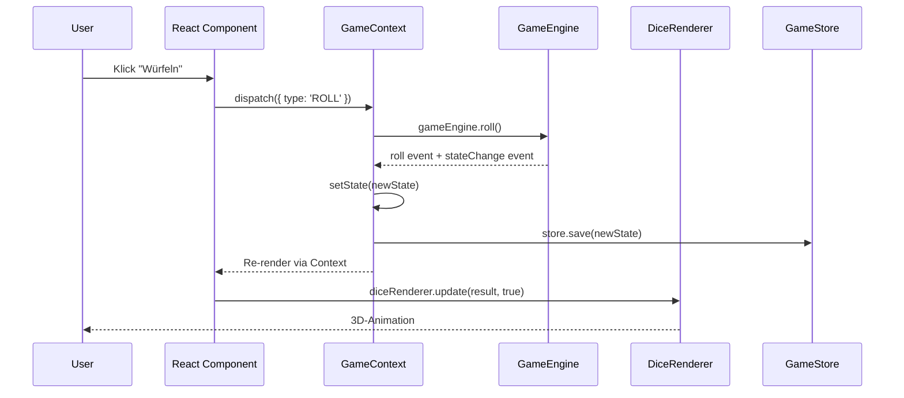

# Design-Dokument — Dice Game React Rewrite

## Übersicht

Dieses Design beschreibt die Architektur der React-Neuimplementierung des Dice Game PWA. Die bestehende Vanilla-JS-App (`dice-game-pwa/`) wird als React 18+ Anwendung in `dice-game-react/` neu aufgebaut. Dabei werden alle UI-unabhängigen Module (Game Engine, Dice Engine, Store, Multiplayer, i18n, Motion) direkt per relativen Import wiederverwendet. Das CSS Design System aus `design-system/` wird über die `.adaptive`-Klasse und `data-*`-Attribute integriert.

### Zentrale Design-Entscheidungen

1. **Kein State-Management-Framework**: React `useReducer` + Context reicht für den Spielzustand. Die Game Engine ist die Single Source of Truth — React synchronisiert sich über Events.
2. **Imperative Module via Refs**: Three.js Dice Renderer, Motion System und WebRTC Peer sind imperativ und werden über `useRef` + `useEffect` in React integriert, nicht als deklarative Komponenten.
3. **Hash-Router selbst gebaut**: Ein minimaler Hash-Router (~50 Zeilen) statt react-router, da nur 4 statische Routen mit Query-Parametern benötigt werden.
4. **Design System ohne Wrapper-Komponenten**: Die `.adaptive`-Klasse und `data-*`-Attribute werden direkt auf JSX-Elemente gesetzt — keine abstrahierenden Wrapper-Komponenten nötig.

## Architektur

### Systemübersicht



### Datenfluss



## Komponenten und Interfaces

### Hash-Router

Minimaler Hash-basierter Router als React-Komponente.

```typescript
// Typen
type Route = 'home' | 'lobby' | 'game' | 'result';
type RouteParams = Record<string, string>;

interface RouterState {
  route: Route;
  params: RouteParams;
}

// Hook
function useHashRouter(): {
  route: Route;
  params: RouteParams;
  navigate: (route: Route, params?: RouteParams) => void;
}
```

Verhalten:
- Lauscht auf `hashchange`-Events
- Parst `#route?key=value` Format
- Default-Route: `#home`
- Deep-Links `#join?sdp=...` → Redirect zu `#lobby?role=client&sdp=...`
- Deep-Links `#answer?sdp=...` → Redirect zu `#lobby?role=host&sdp=...`
- Screen-Transition via Motion System (fade) beim Routenwechsel
- Focus-Management: nach Mount der neuen Screen → Fokus auf erstes `<h1>`/`<h2>` oder erstes fokussierbares Element

### GameContext

Zentraler React Context für den Spielzustand.

```typescript
interface GameContextValue {
  // State
  gameState: GameState | null;
  gameEngine: GameEngine;
  gameStore: GameStore;
  registry: GameModeRegistry;
  
  // Actions
  startGame: (modeId: string, players: Player[], playType: string) => void;
  roll: () => Promise<{ values: number[], rolledIndices: number[] }>;
  toggleHold: (index: number) => void;
  selectScore: (option: ScoreOption) => void;
  resetDice: (count: number) => void;
  loadGame: (gameId: string) => Promise<void>;
}
```

Der Context hält die GameEngine-Instanz als Ref und synchronisiert den React-State über `stateChange`-Events. Jede Mutation geht durch die Engine, der resultierende State wird in React übernommen und im GameStore persistiert.

### Screen-Komponenten

#### HomeScreen
- Zeigt Spielmodus-Karten aus `GameModeRegistry.getAll()`
- Highscore-Liste (Top 5) aus `GameStore.listFinished()`
- Modal-Dialog für Kniffel-Spieltyp-Auswahl (Solo/Lokal/Offline-Multiplayer/Beitreten)
- PlayerSetup-Dialog für Namensinput und Spieleranzahl

#### LobbyScreen
- Host-Modus: SDP-Offer generieren → QR-Code + Deep-Link-URL anzeigen
- Client-Modus: QR-Scanner oder Text-Input für SDP-Offer
- Verbindungsstatus-Anzeige
- Navigation zum GameScreen nach erfolgreicher Verbindung

#### GameScreen
- Horizontal Scroll-Snap Layout (Würfel-Seite | Scoreboard-Seite) für Kniffel
- DiceArea-Komponente mit Three.js Canvas (via Ref)
- PlayerBar mit aktuellem Spieler hervorgehoben
- Roll-Button mit Wurf-Zähler
- Dice-Count-Selector für Free Roll
- ARIA Live Region für Würfelergebnis-Ansagen
- Verbindungsstatus-Banner für Multiplayer

#### ResultScreen
- Rangliste mit Spielernamen, Avataren, Punkten, Rängen
- "Neues Spiel"-Button → Navigation zu Home
- Fehleranzeige falls Spielstand nicht ladbar

### UI-Komponenten

#### DiceArea
Wrapper um den imperativen `DiceRenderer`:

```jsx
function DiceArea({ diceCount, onDieClick }) {
  const containerRef = useRef(null);
  const rendererRef = useRef(null);
  
  useEffect(() => {
    const renderer = createDiceRenderer();
    rendererRef.current = renderer;
    renderer.create(containerRef.current, diceCount);
    
    const handleClick = (e) => onDieClick(e.detail.index);
    containerRef.current.addEventListener('die-click', handleClick);
    
    return () => {
      renderer.destroy();
      containerRef.current?.removeEventListener('die-click', handleClick);
    };
  }, [diceCount]);
  
  // Expose update/setHeld via useImperativeHandle oder Callback
  return <div ref={containerRef} className="dice-area" />;
}
```

#### Modal
Generische Modal-Komponente mit `<dialog>`-Element:
- Backdrop-Klick und Escape schließen den Dialog
- Focus-Trap innerhalb des Modals
- Design System Styling via `.adaptive` + `data-*`

#### ScoreboardReact
React-Neuimplementierung des Scoreboards (statt des imperativen DOM-Scoreboards):
- Rendert die 13 Kniffel-Kategorien als Tabellenzeilen
- Klickbare Zeilen für offene Kategorien mit potentiellen Punkten
- Gefüllte Kategorien mit `data-material="inverted"` und `data-container-contrast="max"`
- Keyboard-Navigation (Enter/Space zum Auswählen)

#### PlayerBar
Horizontale Spielerleiste:
- Avatar (Emoji), Name, Punktestand pro Spieler
- Aktiver Spieler visuell hervorgehoben (`data-emphasis="strong"`)

### Modul-Integrationsmuster

| Modul | Integration | Lifecycle |
|-------|------------|-----------|
| GameEngine | `useRef` in GameContext, Events → `setState` | Erstellt bei `startGame`, lebt bis Spielende |
| DiceRenderer | `useRef` + `useEffect` in DiceArea | `create()` bei Mount, `destroy()` bei Unmount |
| GameStore | `useRef` in GameContext (async init) | Erstellt einmal bei App-Start |
| MotionSystem | Direkt importiert, in Router-Transition genutzt | Stateless, kein Lifecycle |
| WebRTCPeer | `useRef` in LobbyScreen/GameContext | `connect()` bei Lobby-Mount, `disconnect()` bei Cleanup |
| OfflineGameController | `useRef`, erstellt nach WebRTC-Verbindung | Lebt während Multiplayer-Spiel |
| i18n | `setLocale()` bei App-Init, `t()` direkt in JSX | Einmal geladen, global verfügbar |
| DiceAnnouncer | Direkt aufgerufen nach Roll | Stateless |
| QR-Code | In LobbyScreen per `useEffect` | Scanner-Start/Stop bei Mount/Unmount |

## Datenmodelle

### GameState (aus GameEngine)

```typescript
interface GameState {
  gameId: string;
  modeId: 'kniffel' | 'free-roll';
  status: 'playing' | 'finished';
  players: Player[];
  currentPlayerIndex: number;
  currentRound: number;
  maxRounds: number | null;
  dice: {
    values: number[];    // [1-6, ...]
    held: boolean[];     // [true/false, ...]
    count: number;       // 1-6
  };
  rollsThisTurn: number;
  scores: Record<string, ScoreSheet>;
  createdAt: number;
  updatedAt: number;
}

interface Player {
  id: string;
  name: string;
  connectionStatus: 'connected' | 'disconnected';
  isHost: boolean;
}

interface ScoreSheet {
  playerId: string;
  totalScore: number;
  categories: Record<string, number | null>;
}
```

### RouteState

```typescript
interface RouteState {
  route: 'home' | 'lobby' | 'game' | 'result';
  params: {
    modeId?: string;       // 'kniffel' | 'free-roll'
    playType?: string;     // 'solo' | 'local' | 'offline-multiplayer'
    role?: string;         // 'host' | 'client'
    sdp?: string;          // Compressed SDP payload
    gameId?: string;       // For resuming games
  };
}
```

### Multiplayer Connection State

```typescript
type ConnectionStatus = 'connecting' | 'connected' | 'disconnected' | 'failed';

interface MultiplayerState {
  peer: WebRTCPeer | null;
  controller: OfflineGameController | null;
  connectionStatus: ConnectionStatus;
  isHost: boolean;
  playerId: string;
}
```


## Correctness Properties

*Eine Property ist eine Eigenschaft oder ein Verhalten, das über alle gültigen Ausführungen eines Systems hinweg gelten sollte — im Wesentlichen eine formale Aussage darüber, was das System tun soll. Properties bilden die Brücke zwischen menschenlesbaren Spezifikationen und maschinell verifizierbaren Korrektheitsgarantien.*

### Property 1: Route-Parsing Round-Trip

*Für jede* gültige Route (`home`, `lobby`, `game`, `result`) und jede beliebige Menge von Key-Value-Parametern gilt: Das Kodieren als Hash-String (`#route?key1=value1&key2=value2`) und anschließende Parsen muss die ursprüngliche Route und die ursprünglichen Parameter zurückliefern.

**Validates: Requirements 3.1, 3.5**

### Property 2: Alle registrierten Spielmodi werden angezeigt

*Für jede* nicht-leere Menge registrierter Spielmodi in der GameModeRegistry muss die HomeScreen-Komponente genau eine Karte pro Modus rendern, wobei jede Karte den Modusnamen enthält.

**Validates: Requirements 4.1**

### Property 3: Highscore-Liste ist Top 5 absteigend sortiert

*Für jede* Liste abgeschlossener Spiele mit beliebigen Punktzahlen muss die angezeigte Highscore-Liste maximal 5 Einträge enthalten, absteigend nach Punktzahl sortiert, und die höchsten 5 Punktzahlen aus der Gesamtliste repräsentieren.

**Validates: Requirements 4.7**

### Property 4: Würfel-Button deaktiviert bei Wurf-Limit

*Für jeden* Spielzustand im Kniffel-Modus, bei dem `rollsThisTurn` gleich `rollsPerTurn` (3) ist, muss der Würfel-Button als deaktiviert gerendert werden (disabled-Attribut gesetzt).

**Validates: Requirements 5.4**

### Property 5: Spielerleiste zeigt alle Spieler vollständig

*Für jeden* Spielzustand mit einer beliebigen Anzahl von Spielern (1–8) muss die PlayerBar-Komponente genau so viele Spieler-Einträge rendern wie Spieler vorhanden sind, wobei jeder Eintrag Avatar, Name und Punktestand enthält, und genau der Spieler am `currentPlayerIndex` als aktiv hervorgehoben ist.

**Validates: Requirements 5.6**

### Property 6: Würfelergebnis wird per ARIA angekündigt

*Für jedes* Würfelergebnis (Array von 1–6 Werten zwischen 1 und 6) muss der Dice Announcer einen Text in die ARIA-Live-Region schreiben, der alle Würfelwerte enthält.

**Validates: Requirements 5.7, 12.1**

### Property 7: Scoreboard-Struktur ist vollständig

*Für jeden* Kniffel-Spielzustand mit einer beliebigen Anzahl von Spielern (1–8) muss das Scoreboard genau 13 Kategorie-Zeilen, eine Bonus-Zeile, Zwischensummen-Zeilen und eine Gesamtsummen-Zeile rendern, sowie genau so viele Spieler-Spalten wie Spieler vorhanden sind.

**Validates: Requirements 6.1, 6.2**

### Property 8: Offene Kategorien sind klickbar nach Wurf

*Für jeden* Kniffel-Spielzustand, bei dem `rollsThisTurn > 0` ist, muss die Anzahl der klickbaren Scoreboard-Zeilen genau der Anzahl der noch nicht ausgefüllten Kategorien des aktuellen Spielers entsprechen.

**Validates: Requirements 6.3**

### Property 9: Ausgefüllte Kategorien zeigen den Punktwert

*Für jeden* Kniffel-Spielzustand und jede Kategorie, die im ScoreSheet eines Spielers einen Wert ungleich `null` hat, muss die entsprechende Zelle im Scoreboard diesen Wert als Text anzeigen.

**Validates: Requirements 6.5**

### Property 10: Spielzustand-Persistenz Round-Trip

*Für jeden* gültigen Spielzustand gilt: Nach dem Speichern im GameStore und anschließendem Laden mit derselben `gameId` muss der geladene Zustand dem gespeicherten Zustand entsprechen.

**Validates: Requirements 7.2**

### Property 11: Endergebnis absteigend sortiert mit korrekten Rängen

*Für jede* Liste von Spielern mit beliebigen Gesamtpunktzahlen muss die Ergebnis-Rangliste absteigend nach Punktzahl sortiert sein, wobei Spieler mit gleicher Punktzahl denselben Rang erhalten.

**Validates: Requirements 8.2**

### Property 12: Verbindungsstatus-Banner bei Disconnect

*Für jeden* Multiplayer-Spielzustand, bei dem der `connectionStatus` den Wert `disconnected` hat, muss ein Warnungs-Banner sichtbar gerendert werden.

**Validates: Requirements 9.6**

### Property 13: i18n-Fallback gibt Schlüssel zurück

*Für jeden* beliebigen String, der nicht als Übersetzungsschlüssel in den geladenen Nachrichten existiert, muss die `t()`-Funktion den Schlüssel selbst als Rückgabewert liefern.

**Validates: Requirements 10.3**

### Property 14: Interaktive Elemente haben ARIA-Attribute

*Für jedes* interaktive Element (Buttons, klickbare Scoreboard-Zeilen, Würfel-Klickbereich) muss mindestens ein `role`- oder semantisches HTML-Element, ein `aria-label` oder sichtbarer Text, und bei nicht-nativ fokussierbaren Elementen ein `tabindex`-Attribut vorhanden sein.

**Validates: Requirements 12.2**

## Fehlerbehandlung

| Szenario | Verhalten |
|----------|-----------|
| GameStore nicht verfügbar (IndexedDB + localStorage fehlen) | App startet trotzdem, Persistenz wird übersprungen, Warnung in Konsole |
| Spielzustand nicht ladbar auf Result Screen | Fehlermeldung + Button "Zurück zum Start" (Req 8.4) |
| WebRTC-Verbindung fehlgeschlagen | Error-Banner mit "Zurück zum Start"-Button (Req 9.7) |
| WebRTC-Verbindung unterbrochen | Warning-Banner, 10s Timeout → dann "failed" (Req 9.6) |
| Locale-Datei nicht ladbar | Fallback: Schlüssel werden direkt angezeigt (Req 10.3) |
| DiceRenderer GLB-Modell nicht ladbar | Fallback: 2D-Würfel-Darstellung mit Zahlen |
| Ungültige Route im Hash | Redirect zu `#home` |
| SDP-Payload ungültig (Lobby) | Fehlermeldung im Lobby-Screen, erneuter Versuch möglich |
| Kamera-Zugriff verweigert (QR-Scanner) | Fehlermeldung, Text-Input als Alternative |
| Service Worker Registration fehlgeschlagen | App funktioniert weiter, nur ohne Offline-Cache |

## Teststrategie

### Dualer Testansatz

Die Teststrategie kombiniert Unit-Tests und Property-basierte Tests für umfassende Abdeckung:

- **Unit-Tests** (Vitest): Spezifische Beispiele, Edge Cases, Integrationspunkte, Error Conditions
- **Property-basierte Tests** (fast-check + Vitest): Universelle Properties über viele generierte Inputs

### Property-basierte Tests

Bibliothek: **fast-check** (mit Vitest als Test-Runner)

Konfiguration:
- Minimum 100 Iterationen pro Property-Test
- Jeder Test referenziert die zugehörige Design-Property per Kommentar
- Tag-Format: `Feature: dice-game-react-rewrite, Property {number}: {property_text}`
- Jede Correctness Property wird durch genau einen Property-basierten Test implementiert

### Unit-Tests

Unit-Tests fokussieren auf:
- Spezifische Beispiele (z.B. Free Roll navigiert direkt zum Game Screen)
- Edge Cases (z.B. leerer Hash → Home, ungültige Route → Home)
- Error Conditions (z.B. GameStore nicht ladbar, WebRTC fehlgeschlagen)
- Integrationspunkte (z.B. Modal öffnet/schließt korrekt, Keyboard-Navigation)
- Deep-Link-Redirects (#join, #answer)

### Testabdeckung nach Komponente

| Komponente | Unit-Tests | Property-Tests |
|-----------|-----------|---------------|
| HashRouter | Deep-Links, Default-Route, ungültige Routen | Property 1 (Round-Trip) |
| HomeScreen | Modus-Auswahl-Flow, Modal-Verhalten | Property 2 (Modi), Property 3 (Highscores) |
| GameScreen | Roll-Flow, Hold-Toggle, Auto-Scroll | Property 4 (Button-State), Property 5 (PlayerBar), Property 6 (ARIA) |
| ScoreboardReact | Kategorie-Klick, Free-Roll-Summe | Property 7 (Struktur), Property 8 (Klickbar), Property 9 (Werte) |
| GameContext | State-Sync, Persistenz | Property 10 (Round-Trip) |
| ResultScreen | Rangliste, Fehlerfall | Property 11 (Sortierung) |
| Multiplayer | Verbindungsstatus-Banner | Property 12 (Banner) |
| i18n-Integration | Locale-Loading | Property 13 (Fallback) |
| Accessibility | Keyboard-Nav, Focus-Management | Property 14 (ARIA-Attribute) |
