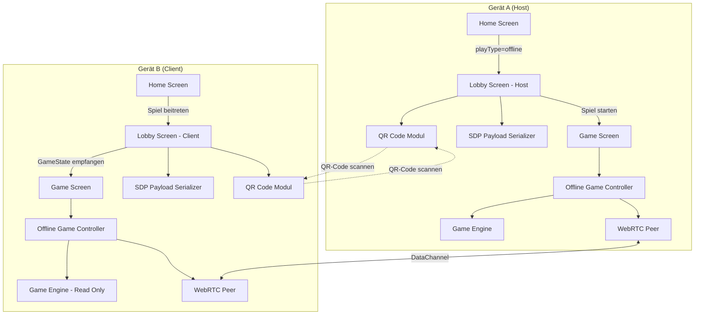
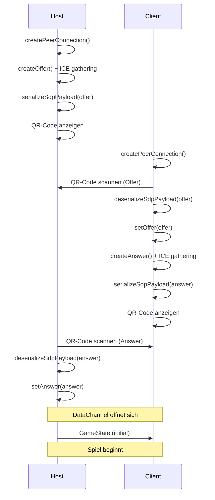

# Design-Dokument: Offline P2P Multiplayer

## Übersicht

Dieses Design beschreibt die Architektur für das Offline-P2P-Multiplayer-Feature der Kniffel/Free-Roll PWA. Zwei Spieler verbinden ihre Geräte über WebRTC ohne Internetverbindung. Der Signaling-Austausch (SDP-Offer/Answer + ICE-Kandidaten) erfolgt manuell über QR-Codes oder Copy/Paste.

Das bestehende `webrtc-peer.js`-Modul bietet bereits die nötige Manual-Signaling-API (`getOffer`, `setOffer`, `getAnswer`, `setAnswer`). Das Design baut darauf auf und ergänzt:

1. **SDP-Payload-Serialisierung** — Kompaktes JSON mit Validierung und Round-Trip-Garantie
2. **QR-Code-Modul** — Kodierung/Dekodierung von SDP-Payloads als QR-Codes (Kamera-Scan + Anzeige)
3. **Offline-Lobby-Screen** — Neuer UI-Flow im bestehenden Lobby-Screen für den manuellen Signaling-Ablauf
4. **Offline-Game-Controller** — Orchestriert Host-Authority-Modell, GameAction-Versand und GameState-Synchronisation über den DataChannel
5. **Service-Worker-Erweiterung** — Caching der neuen Module

### Designentscheidungen

- **Kein neuer Screen**: Der bestehende `lobby-screen.js` wird um einen Offline-Modus erweitert (gesteuert über `playType=offline`), statt einen separaten Screen zu erstellen. Das hält die Router-Konfiguration schlank.
- **Host-Authority**: Der Host ist die einzige Quelle der Wahrheit für den GameState. Der Client sendet GameActions, der Host validiert und sendet den aktualisierten State zurück. Das verhindert Inkonsistenzen.
- **QR-Code-Bibliothek**: Wir verwenden eine leichtgewichtige, dependency-freie QR-Code-Bibliothek (z.B. `qrcode-generator` für Erzeugung, `jsQR` oder die native `BarcodeDetector`-API für Scanning). Falls `BarcodeDetector` verfügbar ist, wird es bevorzugt; ansonsten Fallback auf `jsQR`.
- **SDP-Payload-Kompression**: SDP-Strings können groß sein. Wir kürzen unnötige SDP-Zeilen (z.B. leere Kandidaten-Zeilen) und nutzen Base64-Kodierung, um den QR-Code-Inhalt kompakt zu halten.

## Architektur



### Signaling-Ablauf




## Komponenten und Schnittstellen

### 1. SDP-Payload-Serializer (`js/multiplayer/sdp-payload.js`)

Verantwortlich für Serialisierung, Deserialisierung und Validierung von SDP-Payloads.

```javascript
/**
 * @typedef {object} SdpPayload
 * @property {string} type - "offer" oder "answer"
 * @property {string} sdp - SDP-String
 * @property {object[]} candidates - ICE-Kandidaten
 */

/**
 * Serialisiert einen SDP-Payload zu einem kompakten JSON-String.
 * @param {SdpPayload} payload
 * @returns {string} JSON-String
 * @throws {Error} bei ungültigem Payload
 */
export function serializeSdpPayload(payload) { }

/**
 * Deserialisiert einen JSON-String zu einem SDP-Payload.
 * @param {string} json
 * @returns {SdpPayload}
 * @throws {Error} bei ungültigem JSON oder fehlendem Feld
 */
export function deserializeSdpPayload(json) { }

/**
 * Validiert ein SDP-Payload-Objekt.
 * Gibt { valid: true } oder { valid: false, error: string } zurück.
 * @param {object} payload
 * @returns {{ valid: boolean, error?: string }}
 */
export function validateSdpPayload(payload) { }
```

### 2. QR-Code-Modul (`js/multiplayer/qr-code.js`)

Kapselt QR-Code-Erzeugung und -Scanning.

```javascript
/**
 * Erzeugt ein QR-Code-Bild (als Data-URL) aus einem String.
 * @param {string} data - Zu kodierende Daten
 * @returns {Promise<string>} Data-URL des QR-Code-Bildes
 */
export function generateQrCode(data) { }

/**
 * Startet den Kamera-basierten QR-Code-Scanner.
 * Gibt den dekodierten String zurück, wenn ein QR-Code erkannt wird.
 * @param {HTMLVideoElement} videoElement - Video-Element für Kamera-Preview
 * @returns {Promise<string>} Dekodierter QR-Code-Inhalt
 */
export function scanQrCode(videoElement) { }

/**
 * Stoppt den laufenden QR-Code-Scanner und gibt die Kamera frei.
 */
export function stopScanner() { }
```

### 3. Offline-Lobby-UI (Erweiterung von `js/screens/lobby-screen.js`)

Der bestehende Lobby-Screen wird um den Offline-Signaling-Flow erweitert:

**Host-Flow:**
1. Ladezustand → SDP-Offer wird generiert
2. QR-Code + kopierbarer Text des Offers anzeigen
3. Scanner/Textfeld für das Answer des Clients
4. Verbindungsstatus anzeigen
5. "Spiel starten"-Button (deaktiviert bis verbunden)

**Client-Flow:**
1. Anleitung zum Verbindungsaufbau anzeigen
2. Scanner/Textfeld für das Offer des Hosts
3. QR-Code + kopierbarer Text des Answers anzeigen
4. Verbindungsstatus anzeigen
5. Warten auf GameState vom Host

**Neue UI-Elemente:**
- QR-Code-Anzeige-Container
- Kamera-Scanner-Overlay (mit Video-Element)
- Kopierbares Textfeld für SDP-Payload
- Einfüge-Textfeld für empfangenen SDP-Payload
- Schritt-für-Schritt-Anleitung
- Verbindungsstatus-Indikator

### 4. Offline-Game-Controller (`js/multiplayer/offline-game-controller.js`)

Orchestriert die Spiellogik über den DataChannel.

```javascript
/**
 * @typedef {object} GameAction
 * @property {string} type - Aktionstyp: "roll", "hold", "score", "sync", "start", "end"
 * @property {string} playerId - ID des ausführenden Spielers
 * @property {object} [payload] - Aktionsspezifische Daten
 * @property {number} timestamp - Unix-Zeitstempel
 */

/**
 * Erstellt einen Offline-Game-Controller.
 * @param {object} options
 * @param {object} options.peer - WebRTC-Peer-Instanz
 * @param {object} options.gameEngine - GameEngine-Instanz
 * @param {boolean} options.isHost - Ob dieses Gerät der Host ist
 * @param {string} options.playerId - Lokale Spieler-ID
 * @returns {OfflineGameController}
 */
export function createOfflineGameController(options) { }
```

**Host-Verhalten:**
- Empfängt GameActions vom Client über DataChannel
- Validiert und wendet Actions auf den GameEngine an
- Sendet aktualisierten GameState an den Client
- Erstellt und sendet initialen GameState bei Spielstart

**Client-Verhalten:**
- Sendet lokale GameActions an den Host über DataChannel
- Empfängt GameState-Updates vom Host und ersetzt lokalen State
- Deaktiviert lokale Eingaben, wenn nicht am Zug

### 5. Verbindungsüberwachung

Nutzt die bestehende `monitorConnectionState`-Funktion in `webrtc-peer.js`:

- `connectionState === 'disconnected'` → Warnung anzeigen, Spielzustand lokal beibehalten
- `connectionState === 'failed'` → Meldung + Option zum Home-Screen
- Automatische Wiederverbindung → GameState-Resync vom Host

## Datenmodelle

### SDP-Payload

```javascript
{
  type: "offer" | "answer",     // SDP-Typ
  sdp: "<SDP-String>",          // Session Description Protocol
  candidates: [                  // ICE-Kandidaten
    {
      candidate: "<candidate-string>",
      sdpMid: "<mid>",
      sdpMLineIndex: 0,
      usernameFragment: "<ufrag>"
    }
  ]
}
```

### GameAction

```javascript
{
  type: "roll" | "hold" | "score" | "sync" | "start" | "gameOver",
  playerId: "<uuid>",
  timestamp: 1700000000000,
  payload: {
    // Typ-abhängig:
    // roll: {} (keine zusätzlichen Daten)
    // hold: { dieIndex: 0 }
    // score: { categoryId: "kniffel.ones", score: 3 }
    // sync: { gameState: { ... } }
    // start: { gameState: { ... } }
    // gameOver: { gameState: { ... } }
  }
}
```

### Lobby-State (intern)

```javascript
{
  role: "host" | "client",
  modeId: "kniffel" | "free-roll",
  signalingStep: "generating" | "showing-offer" | "waiting-for-answer" |
                 "scanning" | "showing-answer" | "waiting-for-offer" |
                 "connecting" | "connected",
  localPlayer: { id: "<uuid>", name: "<name>" },
  remotePlayer: { id: "<uuid>", name: "<name>" } | null,
  connectionStatus: "disconnected" | "connecting" | "connected",
  error: null | "<Fehlermeldung>"
}
```


## Correctness Properties

*Eine Property ist eine Eigenschaft oder ein Verhalten, das über alle gültigen Ausführungen eines Systems hinweg gelten sollte — im Wesentlichen eine formale Aussage darüber, was das System tun soll. Properties bilden die Brücke zwischen menschenlesbaren Spezifikationen und maschinell verifizierbaren Korrektheitsgarantien.*

### Property 1: SDP-Payload Round-Trip

*Für jedes* gültige SDP-Payload-Objekt (mit type ∈ {"offer", "answer"}, einem nicht-leeren SDP-String und einem Array von ICE-Kandidaten) soll das Serialisieren mit `serializeSdpPayload` und anschließende Deserialisieren mit `deserializeSdpPayload` ein strukturell äquivalentes Objekt erzeugen.

**Validates: Requirements 3.6, 9.3**

### Property 2: SDP-Payload Strukturelle Invariante

*Für jedes* gültige SDP-Payload-Objekt soll die serialisierte JSON-Repräsentation genau die Felder `type`, `sdp` und `candidates` enthalten, wobei `type` ein String ("offer" oder "answer"), `sdp` ein nicht-leerer String und `candidates` ein Array ist.

**Validates: Requirements 3.1, 3.2, 9.1**

### Property 3: SDP-Payload Validierung — Ungültige Payloads

*Für jedes* Objekt, dem mindestens eines der erforderlichen Felder (`type`, `sdp`, `candidates`) fehlt oder das einen falschen Typ für eines dieser Felder hat, soll `validateSdpPayload` ein Ergebnis mit `valid: false` und einem `error`-String zurückgeben, der das fehlende oder ungültige Feld benennt.

**Validates: Requirements 3.5, 9.2, 9.4**

### Property 4: GameAction Metadaten-Invariante

*Für jede* GameAction, die vom Offline-Game-Controller erstellt wird, soll die Aktion einen `timestamp` (Zahl > 0) und eine `playerId` (nicht-leerer String) enthalten.

**Validates: Requirements 4.5**

### Property 5: Host-Action-Verarbeitung

*Für jeden* gültigen GameState und jede gültige GameAction, die der Host vom Client empfängt, soll der Host die Aktion auf den GameEngine anwenden und einen aktualisierten GameState über den DataChannel senden, dessen `updatedAt`-Zeitstempel größer oder gleich dem vorherigen ist.

**Validates: Requirements 4.3**

### Property 6: Client-State-Ersetzung

*Für jeden* GameState, den der Client vom Host empfängt, soll der lokale Zustand des Clients nach der Verarbeitung exakt dem empfangenen GameState entsprechen.

**Validates: Requirements 4.4**

### Property 7: Zugbasierte Steuerungsaktivierung

*Für jeden* GameState mit zwei Spielern und einem `currentPlayerIndex` soll die Steuerung (Würfeln, Halten) auf dem Gerät des Spielers genau dann aktiviert sein, wenn `currentPlayerIndex` dem lokalen Spieler entspricht.

**Validates: Requirements 5.1, 5.2**

### Property 8: Start-Button-Zustand

*Für jede* Anzahl verbundener Spieler im Lobby-State soll der "Spiel starten"-Button genau dann aktiviert sein, wenn exakt zwei Spieler den Status "connected" haben.

**Validates: Requirements 6.1, 6.2**

### Property 9: Spielzustand-Erhaltung bei Verbindungsabbruch

*Für jeden* GameState und jedes Disconnect-Event soll der lokale Spielzustand nach dem Disconnect unverändert bleiben (deep equality mit dem State vor dem Disconnect).

**Validates: Requirements 7.3**

### Property 10: Reconnection-State-Sync

*Für jeden* GameState zum Zeitpunkt eines Disconnects, wenn die Verbindung wiederhergestellt wird, soll der Host den aktuellen GameState an den Client senden, und der Client soll diesen als seinen lokalen State übernehmen.

**Validates: Requirements 7.4**

## Fehlerbehandlung

### Signaling-Fehler

| Fehlerfall | Verhalten |
|---|---|
| Ungültiger SDP-Payload (JSON-Parse-Fehler) | Fehlermeldung mit Hinweis auf erneutes Scannen/Einfügen |
| SDP-Payload-Validierung fehlgeschlagen | Fehlermeldung benennt das fehlende/ungültige Feld |
| ICE-Gathering-Timeout | Payload wird mit den bis dahin gesammelten Kandidaten erstellt |
| QR-Code zu groß für Kamera-Auflösung | Fallback auf manuelle Texteingabe |

### Kamera-Fehler

| Fehlerfall | Verhalten |
|---|---|
| Kamera-Zugriff verweigert (`NotAllowedError`) | Hinweis auf manuelle Texteingabe |
| Keine Kamera verfügbar (`NotFoundError`) | Scanner-Button ausblenden, nur Texteingabe |
| Kamera-Stream bricht ab | Scanner stoppen, Fehlermeldung, erneut versuchen |

### Verbindungsfehler

| Fehlerfall | Verhalten |
|---|---|
| DataChannel schließt sich unerwartet | Warnung anzeigen, Spielzustand lokal beibehalten |
| `connectionState === 'disconnected'` | Warnung-Banner, Spiel pausiert |
| `connectionState === 'failed'` | Meldung + "Zurück zum Start"-Button |
| Automatische Wiederverbindung | GameState-Resync vom Host |

### Spiellogik-Fehler

| Fehlerfall | Verhalten |
|---|---|
| Client sendet Action, obwohl nicht am Zug | Host ignoriert die Action |
| Ungültige GameAction (falsches Format) | Host ignoriert, loggt Warnung |
| GameState-Sync-Konflikt | Host-State hat Vorrang (Host-Authority) |

## Teststrategie

### Property-Based Testing

Bibliothek: **fast-check** (bereits als devDependency im Projekt vorhanden)

Jeder Property-Test wird mit mindestens **100 Iterationen** ausgeführt und referenziert die entsprechende Design-Property.

**Property-Tests:**

1. **SDP-Payload Round-Trip** — Generiert zufällige gültige SDP-Payloads und prüft `deserialize(serialize(payload)) ≡ payload`
   - Tag: `Feature: offline-multiplayer, Property 1: SDP-Payload Round-Trip`

2. **SDP-Payload Strukturelle Invariante** — Generiert zufällige gültige Payloads und prüft, dass die serialisierte Form die korrekten Felder enthält
   - Tag: `Feature: offline-multiplayer, Property 2: SDP-Payload Strukturelle Invariante`

3. **SDP-Payload Validierung** — Generiert zufällige ungültige Objekte (fehlende Felder, falsche Typen) und prüft, dass Validierung fehlschlägt mit beschreibendem Fehler
   - Tag: `Feature: offline-multiplayer, Property 3: SDP-Payload Validierung`

4. **GameAction Metadaten** — Generiert zufällige GameActions und prüft timestamp > 0 und playerId nicht leer
   - Tag: `Feature: offline-multiplayer, Property 4: GameAction Metadaten-Invariante`

5. **Host-Action-Verarbeitung** — Generiert zufällige GameStates und Actions, prüft dass Host korrekt verarbeitet und updatedAt monoton steigt
   - Tag: `Feature: offline-multiplayer, Property 5: Host-Action-Verarbeitung`

6. **Client-State-Ersetzung** — Generiert zufällige GameStates, prüft dass Client-State nach Empfang exakt dem empfangenen State entspricht
   - Tag: `Feature: offline-multiplayer, Property 6: Client-State-Ersetzung`

7. **Zugbasierte Steuerung** — Generiert zufällige GameStates mit verschiedenen currentPlayerIndex-Werten, prüft Steuerungsaktivierung
   - Tag: `Feature: offline-multiplayer, Property 7: Zugbasierte Steuerungsaktivierung`

8. **Start-Button-Zustand** — Generiert zufällige Lobby-States mit 0-2 verbundenen Spielern, prüft Button-Zustand
   - Tag: `Feature: offline-multiplayer, Property 8: Start-Button-Zustand`

9. **State-Erhaltung bei Disconnect** — Generiert zufällige GameStates, simuliert Disconnect, prüft State-Gleichheit
   - Tag: `Feature: offline-multiplayer, Property 9: Spielzustand-Erhaltung bei Disconnect`

10. **Reconnection-Sync** — Generiert zufällige GameStates, simuliert Disconnect+Reconnect, prüft dass Client den Host-State erhält
    - Tag: `Feature: offline-multiplayer, Property 10: Reconnection-State-Sync`

### Unit-Tests

Unit-Tests ergänzen die Property-Tests für spezifische Szenarien und Edge-Cases:

- **Lobby-Navigation**: Host-Flow (Home → Lobby mit role=host), Client-Flow (Home → Lobby mit role=client)
- **QR-Code-Generierung**: Gültiger SDP-Payload erzeugt Data-URL
- **Kamera-Fallback**: Wenn Kamera nicht verfügbar, wird Texteingabe angezeigt
- **Signaling-Flow**: Vollständiger Offer→Answer→Connect-Ablauf
- **Spielstart**: Host sendet initialen GameState, Client navigiert zum Game-Screen
- **Zugwechsel**: Turn-End-Event wird auf beiden Geräten angezeigt
- **Spielende**: Beide Geräte navigieren zum Result-Screen
- **Verbindungsabbruch**: Warnung bei "disconnected", Meldung bei "failed"
- **Service-Worker-Cache**: Neue Module sind in der Cache-Liste enthalten

### Testdateien

- `tests/sdp-payload.property.test.js` — Property-Tests 1-3
- `tests/sdp-payload.test.js` — Unit-Tests für Serialisierung/Validierung
- `tests/offline-game-controller.property.test.js` — Property-Tests 4-6, 9-10
- `tests/offline-game-controller.test.js` — Unit-Tests für Spiellogik
- `tests/offline-lobby.property.test.js` — Property-Tests 7-8
- `tests/offline-lobby.test.js` — Unit-Tests für Lobby-UI
